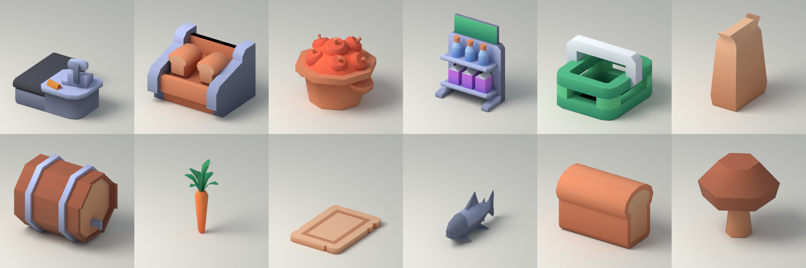
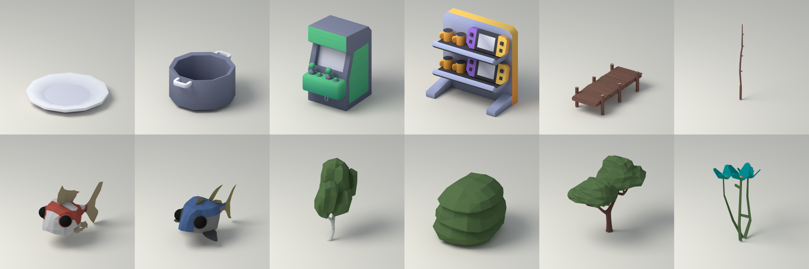
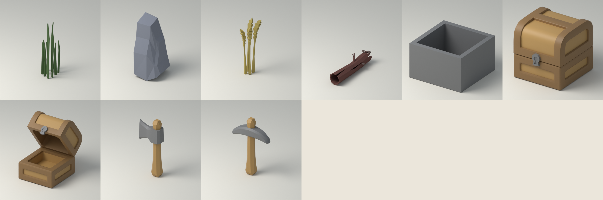

# ART-000 Source Preview Review

Blender Cycles CPU 16 samples, 512×512/model, 동일 조명·카메라, 각 모델 longest extent를 2로 정규화했다. Unity 실제 크기 비교가 아니며 최종 아트/그림자 승인도 아니다. 2026-09-06 세 contact sheet를 직접 검토했다.

## Sheet 1

왼쪽→오른쪽, 윗줄→아랫줄:

- [MiniMarket/cash-register](Previews/PA_REF_MINIMARKET_CASH_REGISTER.png) — USE_WITH_NORMALIZATION
- [MiniMarket/display-bread](Previews/PA_REF_MINIMARKET_DISPLAY_BREAD.png) — DERIVATIVE_SOURCE
- [MiniMarket/display-fruit](Previews/PA_REF_MINIMARKET_DISPLAY_FRUIT.png) — DERIVATIVE_SOURCE
- [MiniMarket/shelf-end](Previews/PA_REF_MINIMARKET_SHELF_END.png) — DERIVATIVE_SOURCE
- [MiniMarket/shopping-basket](Previews/PA_REF_MINIMARKET_SHOPPING_BASKET.png) — USE_WITH_NORMALIZATION
- [FoodKit/bag](Previews/PA_REF_FOODKIT_BAG.png) — DERIVATIVE_SOURCE
- [FoodKit/barrel](Previews/PA_REF_FOODKIT_BARREL.png) — DERIVATIVE_SOURCE
- [FoodKit/carrot](Previews/PA_REF_FOODKIT_CARROT.png) — USE_WITH_NORMALIZATION
- [FoodKit/cutting-board](Previews/PA_REF_FOODKIT_CUTTING_BOARD.png) — USE_WITH_NORMALIZATION
- [FoodKit/fish](Previews/PA_REF_FOODKIT_FISH.png) — DERIVATIVE_SOURCE
- [FoodKit/loaf](Previews/PA_REF_FOODKIT_LOAF.png) — USE_WITH_NORMALIZATION
- [FoodKit/mushroom](Previews/PA_REF_FOODKIT_MUSHROOM.png) — REFERENCE_ONLY
## Sheet 2

왼쪽→오른쪽, 윗줄→아랫줄:

- [FoodKit/plate](Previews/PA_REF_FOODKIT_PLATE.png) — USE_WITH_NORMALIZATION
- [FoodKit/pot](Previews/PA_REF_FOODKIT_POT.png) — USE_WITH_NORMALIZATION
- [MiniArcade/arcade-machine](Previews/PA_REF_MINIARCADE_ARCADE_MACHINE.png) — REFERENCE_ONLY
- [MiniArcade/prizes](Previews/PA_REF_MINIARCADE_PRIZES.png) — REFERENCE_ONLY
- [CuteFish/Dock_Long_NoRope](Previews/PA_REF_CUTEFISH_DOCK_LONG_NOROPE.png) — DERIVATIVE_SOURCE
- [CuteFish/FishingRod_Lvl1](Previews/PA_REF_CUTEFISH_FISHINGROD_LVL1.png) — USE_WITH_NORMALIZATION
- [CuteFish/Koi](Previews/PA_REF_CUTEFISH_KOI.png) — REFERENCE_ONLY
- [CuteFish/Tuna](Previews/PA_REF_CUTEFISH_TUNA.png) — USE_WITH_NORMALIZATION
- [UltimateNature/BirchTree_1](Previews/PA_REF_ULTIMATENATURE_BIRCHTREE_1.png) — USE_WITH_NORMALIZATION
- [UltimateNature/Bush_1](Previews/PA_REF_ULTIMATENATURE_BUSH_1.png) — USE_WITH_NORMALIZATION
- [UltimateNature/CommonTree_1](Previews/PA_REF_ULTIMATENATURE_COMMONTREE_1.png) — USE_WITH_NORMALIZATION
- [UltimateNature/Flowers](Previews/PA_REF_ULTIMATENATURE_FLOWERS.png) — USE_WITH_NORMALIZATION
## Sheet 3

왼쪽→오른쪽, 윗줄→아랫줄:

- [UltimateNature/Grass_Short](Previews/PA_REF_ULTIMATENATURE_GRASS_SHORT.png) — USE_WITH_NORMALIZATION
- [UltimateNature/Rock_1](Previews/PA_REF_ULTIMATENATURE_ROCK_1.png) — DERIVATIVE_SOURCE
- [UltimateNature/Wheat](Previews/PA_REF_ULTIMATENATURE_WHEAT.png) — USE_WITH_NORMALIZATION
- [UltimateNature/WoodLog](Previews/PA_REF_ULTIMATENATURE_WOODLOG.png) — USE_WITH_NORMALIZATION
- [CubeWorldKit/Cart](Previews/PA_REF_CUBEWORLDKIT_CART.png) — REFERENCE_ONLY
- [CubeWorldKit/Chest_Closed](Previews/PA_REF_CUBEWORLDKIT_CHEST_CLOSED.png) — DERIVATIVE_SOURCE
- [CubeWorldKit/Chest_Open](Previews/PA_REF_CUBEWORLDKIT_CHEST_OPEN.png) — DERIVATIVE_SOURCE
- [CubeWorldKit/Axe_Stone](Previews/PA_REF_CUBEWORLDKIT_AXE_STONE.png) — DERIVATIVE_SOURCE
- [CubeWorldKit/Pickaxe_Stone](Previews/PA_REF_CUBEWORLDKIT_PICKAXE_STONE.png) — DERIVATIVE_SOURCE

## 관찰과 적용 판단

MiniMarket는 큰 chamfer와 두꺼운 판·기둥, FoodKit은 6~12각 원통과 얇은 식기 구조가 읽힌다. 원본 진열대에 상품이 고정되어 있으므로 빈 슬롯용 파생 작업이 필요하다. 수납함/계산대의 형태는 읽히지만 슈퍼마켓 회색·초록색을 그대로 마을의 최종 팔레트로 쓰지 않는다.

Nature는 나뭇잎을 작은 잎 대신 큰 2~4 덩어리로 표현하고, 줄기/가지의 비대칭과 flat facets를 유지한다. Fish는 둥근 큰 눈과 얇은 지느러미가 특징이다. 긴 낚싯대와 Wheat/Grass는 작은 게임 화면에서 얇아질 수 있어 후속 silhouette/scale 확인이 필요하다.

Cube Chest는 부드러운 덮개·장식 프레임과 잠금쇠가 강해 생활 수납함으로 쓸 때 잠금 기능을 암시하지 않도록 파생한다. Cart는 상자 형태 참고로만 쓴다. 광석·새 종의 물고기·새 게임 아이템을 모델 이름 때문에 만들지 않는다.

Source render에서 접지 그림자·가는 지느러미 그림자·부두 기둥 분리는 보인다. Unity의 실제 태양·밤 조명·distance shadow/LOD는 여기서 확인 못 함. ART-001의 격리 preview와 ART-002~004 적용 시 확인한다.
