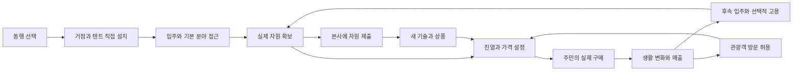

# 무인도 정착 오프닝 제작 명세 v0.1

작성: 2026-09-07. 상태: **사용자 구상을 실행 단위로 구체화한 설계안. 구현·새 캐논·새 자동 진행 승인으로 취급하지 않는다.**

함께 읽기: [상세 검토](SETTLEMENT_REVIEW_2026-09-07.md) · [첫 작업 지시서](../../AI_WORKFLOW/03_TASKS/SETTLEMENT_001_HQ_OPENING.md) · [검증 기록](SETTLEMENT_DESIGN_AUDIT_2026-09-07.md).

## 1. 제작 기준

플레이어는 무인도에 사는 잡화점 주인이자 마을을 꾸리는 사람이다. 낮에는 주민과 자원을 확보하고 장소를 만들며, 밤에는 직접 진열·가격 설정·재고 보충을 한다. NPC는 기존 구매 판단을 거쳐 사고 거절한다. 실제 판매가 주민의 생활과 마을 모습에 남는다.

사용자가 제시한 방향: 본사 실습, 1차 생산자 동행 선택, 배로 이동, 직접 거점·주거 배치, 입주 후 고용, 본사에 자원을 제출하는 기술 해금, 공급에 따른 상품 차이, 이후 섬 특화, 선택 가능한 관광객 유입.

이번 명세의 권장 기본값: 동행 2명, 후보 목표 5직업, 본사 구간 2~3분, 첫 정착 체험 20~30분/2~3일. 측정 전 목표이고 인원·수치 확정은 아니다. 본사 안내자와 신규 후보의 고유 이름·종은 임시로 만들지 않는다.

## 2. 시작부터 첫 결말까지

시간은 능숙하지 않은 첫 플레이 기준의 제작 목표다. 게임 시계 설정의 고정값으로 환산하지 않는다. 현재 WorldSandbox는 준비 중 시계와 플레이 시계 속도를 구분하므로, 실제 세션 속도를 측정해서 연출을 맞춘다.

| 단계 | 목표 시간 | 화면과 플레이어 행동 | 다음 단계의 실제 조건 |
|---|---|---|---|
| H00 출항 작업장 | 0:00~0:20 | 창밖 항구, 작업대의 가격표와 빈 진열대. 출항 명부를 확인 | 안내를 닫음. 시간 경과만으로 교육 완료 처리하지 않음 |
| H01 짧은 실습 | 0:20~1:40 | 이동, 물건 1개 진열, 가격표 변경. 연습 손님의 판단과 반응을 봄 | 실제 진열·가격 확정·평가 결과를 각각 확인 |
| H02 동행 선택 | 1:40~2:40 | 후보의 공급품·희망·다음 상품을 살펴보고 2명을 선택 | 서로 다른 후보 2명, 지원품 안내를 확인하고 출항 확정 |
| H03 출항 | 2:40~3:00 | 선택한 주민과 짐이 배에 실림. 짧은 항해 장면 | 확정된 동일 주민 ID와 초기 지급 내역을 가진 도착 상태 |
| I00 도착·둘러보기 | 3:00~4:00 | 식생·해안이 있는 자연 섬. 짐 내린 지점에서 주변을 봄 | 도착 안내를 마치고 설치 모드 사용 가능 |
| I01 내 거점 설치 | 4:00~6:00 | 주거 겸 판매 거점을 원하는 위치에 설치 | 경로·충돌 검증을 통과한 거점 1개가 실제 생성 |
| I02 이웃 자리 잡기 | 6:00~8:00 | 두 텐트의 위치와 입구 방향을 정함. 주민이 자신의 집으로 이동 | 각 텐트에 동일 주민 ID가 배정되고 입주 완료 |
| I03 첫 재고 | 8:00~11:00 | 공통 채집과 선택 분야 작업, 가지고 온 공급품을 가방에서 확인 | 판매 가능한 실제 아이템 확보. 기초 분야 접근 활성 |
| N00 첫 영업 | 11:00~16:00 | 진열대에 배치하고 가격 설정, 밤에 간판을 열고 주민을 맞음 | 첫 판단과 첫 판매를 별도 기록. 매출은 거래 성공 때만 증가 |
| D02 생활 변화 | 16:00~18:00 | 다음 날 산 주민의 텐트 앞에서 상품에 맞는 작은 변화 발견 | 판매 기록을 근거로 해당 주민·장소에 변화 1회 적용 |
| D02 기술 투자 | 18:00~22:00 | 일부 자원을 본사에 제출해 첫 가공 기술/필요 설비 설치권 확보 | 자원 차감과 기술 지급이 한 번만 완료되고 실제 사용 가능 |
| D03 작업 위임 | 22:00~27:00 | 입주민과 유료 계약, 실제 작업 결과를 받고 가게에 활용 | 같은 NPC가 계약에 따라 일하고 비용·결과가 기록 |
| E00 체험의 마무리 | 27:00~30:00 | 첫날 빈자리와 지금의 집·가게·생활 흔적을 현재 화면에서 비교 | 다음 날 계속 생활 가능. 관광/연구 방향은 짧은 전망만 제시 |

30분에 맞추려고 매출·친밀도·기술 완료를 자동 지급하지 않는다. 시간이 넘치면 문구·동선·필요 수량을 다듬고 재검증한다. 본사 실습을 생략해도 동일한 출항 지원품과 선택 기회를 받으며, 생략을 기술/매출 달성으로 기록하지 않는다.

## 3. 첫 장면의 연출·대사

### H00 — 본사 출항 작업장

장소는 항구 옆 본사의 작은 실습·발송 공간이다. 따뜻한 재질의 작업대, 묶인 짐, 빈 가격표, 창밖의 배가 화면의 중심이다. 회사 로고를 크게 비추거나 서류를 여러 장 읽히는 구성이 아니다. 기존 미술 문법과 권리 기록이 있는 자산을 사용한다.

첫 3~4초는 작업대에서 항구가 보이는 구도로 시작한다. 첫 상호작용은 출항 명부다. 최종 연결 버전에서는 20초 안에 이동하거나 상품을 만지게 한다. 아래 대사는 이 문서를 위해 새로 쓴 초안이다.

- 안내자: “출항 준비는 거의 끝났어요. 이제 섬에서 함께 지낼 사람을 정하면 돼요.”
- 안내자: “가게와 집을 어디에 둘지는 직접 골라 주세요. 처음 자리를 잡을 짐은 실어 뒀어요.”
- 안내자: “그전에 가격표를 한 번 붙여 볼까요? 섬에서는 이 작은 가게가 이웃들의 생활을 도울 거예요.”

대사는 한 화면에 하나씩. 안내자는 직책만 사용하고 보리/루카로 자동 지정하지 않는다. 첫 티켓은 이 장면과 명부 안내 상호작용까지만 만든다. 실습·동행·출항은 별도 작업이다.

### H01 — 진열과 가격 실습

한 진열대, 한 연습 상품, 한 손님으로 충분하다. 가방→진열→가격 확정→평가 반응을 직접 해 본다. 상품 가격이 NPC의 기대와 다를 수 있다는 사실을 배우면 된다. 본사 실습은 낮 영업 규칙의 일반 예외가 되지 않는 격리된 교육 세션이다.

실제 `ShopSlot`과 `PurchaseEvaluator`를 사용하되 캠페인 돈·매출·친밀도·마을 변화에 실습 기록을 합치지 않는다. 격리 방식은 전용 실습 티켓에서 기존 서비스 권위를 조사해 정한다. 별도 가짜 경제식은 만들지 않는다. 이 격리가 확인되기 전에는 실제 거래 실습을 캠페인에 붙이지 않는다.

손님이 거절해도 “가격을 바꿔 다시 시도할 수 있어요” 안내 후 진행할 수 있다. 교육 통과 조건은 평가 결과를 이해하는 것이며 반드시 구매 성공일 필요는 없다. 본게임의 첫 매출은 섬에서 실제 거래를 해야 발생한다.

### H02/H03 — 동행자 선택과 배

후보 카드는 `이 사람`, `처음 확보할 물건`, `열리는 다음 기술`, `살고 싶은 생활 자리`를 보여준다. 선택한 두 사람의 예상 첫 진열품을 화면 아래에 함께 보여주고 출항 전까지 바꿀 수 있다. 최적 조합·등급·희귀도 표현은 쓰지 않는다.

목재 역할 대사 예: “필요한 나무는 같이 구해요. 작업이 끝나면 가게 앞에서 잠깐 쉬어도 좋겠네요.”
어업 역할 대사 예: “먼저 물가를 둘러볼게요. 저녁에는 오늘 잡은 걸 가게에 가져올 수 있어요.”

항해는 약 10~20초로, 선택한 주민과 짐이 보이는 한 장면이면 충분하다. 조타·파도 물리·배 안 자유 이동을 요구하지 않는다. 건너뛰어도 동일한 확정 선택과 지급 내역으로 도착한다. 배경용 다른 주민을 선택한 사람인 것처럼 표시하지 않는다.

## 4. 입주·기술·고용의 계약

| 개념 | 조건 | 플레이어가 얻는 것 | 비용/유지 |
|---|---|---|---|
| 출항 동행 | 후보 선택 확정 | 함께 도착할 사람과 분야별 초기 지원 | 처음 2명의 이동·정착 지원은 출항 지원품에 포함하는 안 |
| 입주 | 거점 설치 + 유효한 본인 텐트/주거 + 당사자 동의 | 주민 일과·대화·소비, 해당 기본 분야 접근 | 후속 입주는 운송/정착 지원비. 사람 자체의 구매 가격으로 표현하지 않음 |
| 기술 전수 | 선행 기술 + 본사 요구 자원 제출 | 플레이어에게 지속되는 제작/작업 능력 | 자원 소비. 같은 기술 재구매 없음 |
| 고용 | 입주 완료 + 계약 대상 작업 가능 + 비용 충족 | 일정 기간 작업 위임 | 현행 계약 비용 권위를 우선 사용. 계약 종료해도 주민·주거·기술 유지 |

주민은 `후보 → 동행 확정 → 도착 → 주거 배정 → 입주` 순서로 진행한다. 고용은 입주 이후의 별도 상태다. 저장·로드·고용 때 새 사람을 만들어 기존 주민과 중복시키지 않는다.

휴대폰의 기존 채용 탭 안에서 먼저 ‘입주 준비’와 ‘거주 중’ 상태를 구분한다. 미입주 후보를 누르면 계약 버튼 대신 필요한 주거와 정착 조건을 보여준다. 거주 중인 주민을 선택하면 가능한 일과 비용을 보여준다. 전체 휴대폰을 새로 만들지 않는다.

첫 두 주민의 생산품을 무료로 영구 공급하지 않는다. 출항 지원분은 일회 지급, 직접 확보는 플레이어의 시간, 납품 구매는 재고 원가, 고용은 작업 위임 비용으로 구분한다. 임금과 납품비가 같은 물건에 중복 청구되는지 계약별로 명시한다.

## 5. 자유 배치와 막힘 방지

신규 정착 캠페인의 섬에는 자연 지형·자원·착륙 지점이 있지만 완성된 마을과 생산 시설은 없다. 처음부터 모든 지형을 바꾸도록 요구하지 않는다. 기존 WORLD 생성/배치/경로 검증을 이용하고 임의의 새 월드 엔진을 만들지 않는다.

초기 지원품은 `주거 겸 상점 거점 키트 1개 + 주민 텐트 키트 2개 + 공통 기초 도구 + 선택 분야 작업 지원`으로 정의한다. 거점의 생활 부분과 판매 부분은 하나의 외형이라도 기존 Shop 권위에 연결한다. 이 키트는 자원 제출·판매 대상이 아니며 설치 취소 때 회수한다. 확정되지 않은 배치에 소비하지 않는다.

권장 위치 2~3곳은 선택을 돕는 표시일 뿐이다. 입구 여유 공간, 착륙 지점↔거점↔각 텐트 경로, 생산 작업 지점 접근이 모두 유효해야 확정한다. 첫날 이전 비용은 면제하는 안을 권한다. 이전 중 재고·집 주인·상점 ID를 새로 만들지 않는다.

특정 생산자를 데려오지 않아도 공통 낙목/식재료 확보와 기본 설치가 가능해야 한다. 목재 생산자는 규모 있는 목재 공급·후속 가공 경로를 열며, 모든 나무를 만질 수 있는 유일한 권한을 갖지 않는다. 다른 직업도 기본 생활과 전문 생산을 구분한다.

## 6. 분야별 해금망

기호: L0=입주로 여는 기초 분야, L1=본사에 첫 재료 제출, L2=후속 응용. 첫 기술 수량은 **시제품용 제안**, 현재 데이터 변경이 아니다. 곤충 아이템·기술은 아직 신규 제작 대상이다.

| 분야 | L0: 입주 때 확보 가능 | L1: 첫 제출 제안 → 효과 | L2 이후/2차 인력 |
|---|---|---|---|
| 목재 | 나무 작업 접근, 기본 목재 지원 | 나무 6개 → 판자 가공과 해당 작업대 설치 접근 | 목공 전문가, 실제 가구 판매와 생활 공간 |
| 광물 | 얕은 광물 작업 접근, 기본 채굴 지원 | 광물 3개 → 철괴 가공과 해당 화덕/대장 작업 설비 접근 | 대장장이, 도구/생활 설비 |
| 어업 | 낚시 작업 접근, 기본 어업 지원 | 생선 3개 → 생선구이와 해당 조리 설비 접근 | 요리 전문가, 음식 공급·방문객 식사 수요 |
| 농업 | 재배 접근, 초기 수확물과 씨앗 지원 | 밀 5개 → 빵 가공과 해당 조리 설비 접근 | 제빵/가공 전문가, 농산물 가공·꾸준한 식품 재고 |
| 곤충 | 포획/관찰 접근과 기본 채집 도구 | 흔한 곤충 3개 → 관찰 세트 제작·전시용 상품 접근 | 조사/제작 전문가, 관찰 의뢰와 과학 방문 수요 |

곤충 L1은 판매 단가도 아직 없으므로 기존 네 분야와 수치 균형을 입증하지 못했다. 종류를 요구하는 복잡한 도감 조건은 첫 기술에 넣지 않는다. 첫 농작물은 일회 지원분으로 첫 판매가 가능하고, 직접 기르는 과정은 별도로 경험하게 한다.

초기 가공은 플레이어가 할 수 있는 소규모 작업이다. ‘2차 생산자 입주’는 모든 가공을 처음 허용하는 전역 잠금이 아니라, 심화 상품과 작업 위임을 넓히는 후속 단계로 권한다. 기존 목수/벌목꾼, 광부/대장장이 역할과 맞출 수 있다. 해당 인물의 확정 이름·등장 순서는 캐논 대응 작업에서 정한다.

기존 레시피의 Tier와 시설 조건을 확인하고 기술 조건을 결합한다. 기술만 열었다고 필요한 시설이 없어 아무것도 못 하는 상태를 막으려면 첫 기술에 해당 설비를 설치할 경로를 함께 제공해야 한다. 기존 Tier 1/2 상품을 첫날 보상으로 강제 해제하지 않는다.

공통 성장 연결은 다음과 같다.

각 L1 노드의 데이터는 `안정적인 기술 ID / 선행 ID / 필요 입주 분야 / 아이템 ID·수량 / 결과 레시피·설비 접근 / 한 번만 주는 지급 ID`를 갖는다. 직업명 문자열이나 UI 노드 위치를 저장 키로 쓰지 않는다. 이미 배운 기술은 주민의 근무 종료로 잠기지 않는다.

본사 제출은 휴대폰에서 품목·수량·제출 후 잔량·배울 내용을 확인하고 거점 발송함에서 확정하는 안이다. 화면을 닫거나 부족하면 차감하지 않는다. 지원 키트·진열 중 물건을 자동으로 끌어오지 않는다. 자원 차감과 해금을 같은 저장 가능한 거래로 처리하고, 반복 입력·저장 중단·로드로 두 번 지급하지 않는다. 네트워크나 실제 택배 대기 시뮬레이션은 필요 없다.

## 7. 상점 판매와 다음 날 변화

판매 공간은 월드 안에서 보이는 진열대로 구성한다. 상품과 가격표의 접근 면이 명확하고, 플레이어가 위치를 고른 거점에 연결된다. 휴대폰의 품목 판매 버튼으로 실제 진열을 대체하지 않는다.

순서는 `가방 상품 → ShopSlot 진열 → ShopPriceUI 가격 확정 → 밤 영업 개점 → NPC 접근 → PurchaseEvaluator 판단 → 실제 구매/거절 → 거래 기록과 피드백`이다. 구매 확률·돈·진열 소모·매출은 기존 권위를 사용한다.

데모는 기존 가격·품질·성향에 대한 표정/말풍선과 결과를 정확하게 읽히게 한다. 새로운 누적 만족도·평판 경제를 동시에 추가하지 않는다. 평가상 비싸서 망설였는데 UI가 ‘좋아하는 물건이 아니에요’로 단정하지 않도록 실제 사유와 문구를 맞춘다. 확률을 화면에 숫자로 공개할지는 추후 UI 판단이며 필수 기능이 아니다.

첫 생활 변화는 거래의 `주민 ID + 아이템/카테고리 + 수량 + 판매일`을 근거로 한다. 원재료는 정리된 생활 재료/작업 자리, 식품은 식사 행동, 관찰 상품은 관찰 자리처럼 관련 결과를 붙인다. 처음에는 소품 1개와 짧은 대사 정도로 충분하다. 대표 대사는 “어제 가게에서 산 걸 여기에 두었어요. 한결 편해졌네요.”이며 실제 구매한 사람만 말한다.

현재 변화 시스템이 카테고리 매출 신호까지만 제공한다면, 개인별 사용 결과는 추가 작업으로 표기한다. 이미 구현된 것으로 보여주기 위해 대사만 강제로 실행하지 않는다. 주민의 소비 예산·출처가 현재 거래 권위에 모델링되어 있는지 확인하고, 플레이어에게 지급된 돈을 주민에게 계속 되돌려 주는 지원금 순환을 만들지 않는다.

가격이 높아 첫 판매가 실패해도 재고·진행을 초기화하지 않는다. 판단 결과를 읽고 가격을 바꾸거나 다음 영업을 할 수 있다. 첫 기술과 다음 날 행동을 ‘첫 판매 성공’ 하나에 모두 묶어 기다리는 시간을 늘리지 않는다. 관광객이 없어도 동행 주민과 공통 수요를 통해 진행할 경로를 유지한다.

## 8. 경제 시제품과 검증 목표

현재 가격·레시피 근거는 [검토 §6](SETTLEMENT_REVIEW_2026-09-07.md)에 있다. 다음은 실제 밸런스 티켓을 위한 목표다.

| 항목 | 시제품 기준 | 측정/수정 방법 |
|---|---|---|
| 첫 기술 투자 | 기존 4분야 제출품 기준가 합 45~54G | 목재 48, 광물 45, 생선 54, 밀 50. 획득 시간·품질 차이는 별도 측정 |
| 첫 재고 | 지원분과 1~2회의 직접 작업으로 첫 영업 재고 확보 | 첫 제출에 모든 판매품을 소비하지 않아도 되는지 확인 |
| 도매 수익 | 기준가 판매에도 재고 보충 가능한 구조를 목표 | 실제 납품 원가·설정가·확률·노동을 함께 조정. 0차액 현황을 먼저 실측 |
| 가공 보상 | 재료 직접 판매와 비교해 시간 대비 이유가 있음 | 빵과 생선구이의 실제 품질·판매율·작업 시간을 우선 비교 |
| 초기 기술 속도 | 직접 획득 경로로 짧은 작업 구간 안에 첫 제출 가능 | 내부 목표 2~4분의 능동 작업. 대기·이동 시간을 별도로 기록 |
| 첫 고용 | 첫 정착 체험 안에 정상 매출로 한 번 시도 가능 | 현재 실제 계약 비용을 확인 후 수입 경로/기간 조정. 현금 치트로 통과 금지 |
| 무자금 회복 | 입주·고용비 지출 후에도 무료 직접 활동으로 수입 재개 | 추가 지원금 무한 지급 없이 검증 |
| 조합 간 편차 | 첫 기술까지 중앙값 시간의 최대/최소 1.5배 이내를 초기 목표 | 평균만 보지 않고 첫 판매·기술 도달 P90과 막힘을 기록 |

첫 검증은 기존 4분야의 6조합, 이후 곤충 포함 총 10조합을 비교한다. 조합마다 동일한 지형 조건과 가격 정책, 여러 NPC 판단 난수 조건으로 실행한다. 최소 10회씩은 초기 이상치 탐지용이며 통계적으로 균형이 입증됐다는 뜻은 아니다. 구조상 도달 가능성 검사와 Unity의 실제 소요 시간·경로·구매 검증을 분리한다.

관광객은 이 기본 경제의 필수 구매자가 아니어야 한다. 관광객을 꺼 둔 조건을 먼저 통과시킨 뒤 켠 조건에서 재고 회전과 수익 폭을 비교한다. 섬의 주력 상품은 공급과 플레이어의 선택으로 달라지며, 미선택 분야 상품의 진열 자체를 금지하지 않는다.

## 9. 항구 개폐 — 데모에 넣는다면 이 범위

플레이어 문구는 **‘관광객 방문 허용’**으로 한다. 항구를 모두 폐쇄해 본사 연락·입주·물류까지 막는다는 오해를 줄인다. 첫 정착 캠페인은 방문 불허로 시작하고, 거점과 첫 영업 안내를 갖춘 뒤 플레이어가 켤 수 있게 한다. 첫 체험의 필수 완료 조건에는 넣지 않는다.

기존 `CustomerArrivalController`에는 임시 관광객 목록, 주민과의 구분, 영업당 기본 2명/동시 기본 1명, 쇼핑·귀환 처리가 있다. 이를 기본값으로 재사용하고 이번 명세에서 인원을 올리지 않는다. 관광객 모델을 신규 입주자로 등록하지 않는다.

| 상황 | 규칙 |
|---|---|
| 방문 불허 | 새 관광객 생성/입장만 중지. 주민 영업·생산·입주 준비·본사 제출은 유지 |
| 방문 허용, 가게 닫힘/낮 | 데모에서는 새 쇼핑 관광객을 생성하지 않음. 낮 관광 동선은 후속 |
| 방문 허용, 밤 영업, 판매 재고 있음 | 기존 간격·동시 인원·영업당 한도 안에서 입장 시도 |
| 재고 없음 | 새 입장을 보류. 기존 손님을 삭제하지 않음 |
| 관광객이 있는 동안 방문 불허 | 이미 들어온 손님은 기존 쇼핑·귀환 흐름을 마침. 가게 폐점 시 기존 폐점 규칙 적용 |
| 방문 토글을 반복 | 다음 입장 시점과 누적 한도를 초기화하지 않음. 열자마자 밀린 손님 몰아 생성 금지 |
| 같은 밤 가게를 반복 개폐 | 신규 캠페인의 관광객 총량은 영업일 ID 기준. 폐점/재개점으로 기본 한도 반복 지급 금지 |
| 저장·로드 | 방문 허용 여부, 영업일 ID, 이미 사용한 방문 한도를 복구. 임시 관광객 객체는 기존처럼 정리; 사용한 한도는 환급하지 않음 |
| 다음 영업일 | 그날의 한도를 새로 시작. 실제 게임 날짜를 기준으로 한 번만 초기화 |
| 기존 세이브/Golden | 신규 정착 캠페인임이 명시되지 않은 저장은 기존 동작 유지. 새 기본값을 강제로 덮어쓰지 않음 |

조건을 추가할 중심 지점은 `TryInviteTourist()`다. `TryInviteWave()`의 주민 초대까지 차단하면 안 된다. 이름이나 직업 프로필로 방문객을 구분하지 말고 기존 `IsTransientTourist`와 방문 기록을 사용한다. 항구를 켜는 콜백에서 손님을 즉시 강제 생성하지 않는다.

현재 `PrepareForStateRestore()`는 관광객 객체와 한도를 정리한다. 위 저장 규칙은 **추가 구현이 필요한 부분**이다. 따라서 ‘불리언 하나만 붙이면 끝’이라고 견적 내리지 않는다. 방문 권한·당일 한도 저장을 위한 추가 확장과 회귀 검증을 별도 bounded ticket으로 나눈다.

정기 배는 당장은 출항/도착 연출과 귀환 지점의 표현이면 충분하다. 실제 배 운항표·좌석·호텔 예약·관광세·항구 증축은 이 기능에 포함하지 않는다. 방문객 추가로 재고 소진과 마을 활동이 늘어나는 것이 열고 닫는 이유가 되어야 한다. 그 차이가 체감되지 않으면 토글을 억지로 핵심 시스템으로 키우지 않는다.

## 10. 저장·입력·실패 처리 계약

후속 저장 확장은 안정적인 캠페인 ID와 단계, 선택한 resident ID들, 일회 지급 ID들, 설치된 거점/주거 ID와 소유 관계, 기술 ID 집합, 적용한 판매 변화 ID, 관광 허용/당일 한도를 다룬다. 기존 envelope/world 버전 숫자를 이 문서에서 새로 지정하지 않는다. 현재 작업 트리가 이전 PASS 이후에도 수정되어 있으므로 착수 때 실물 기준으로 추가 확장한다.

| 중단/예외 | 복구 기준 |
|---|---|
| 선택 중 취소 | 출항 전 선택만 변경. 주민 생성·지원품 지급 없음 |
| 출항 직후 중단 | 출항 확정 데이터로 같은 두 사람이 도착. 신규 후보 재추첨 없음 |
| 배치 미리보기 취소 | 실제 건물·비용·집 주인 관계를 변경하지 않음 |
| 첫 텐트 뒤 저장 | 남은 텐트만 설치. 이미 입주한 주민 중복 없음 |
| 제출 버튼 연타/로드 | 자원 차감과 기술 지급은 거래 ID 기준 한 번 |
| 가격표·휴대폰이 열린 상태 | 해당 UI가 입력 소유. 같은 Space가 대화 완료·개점·새 게임을 동시에 실행하지 않음 |
| 거절·경로 실패 | 구매 성공 이벤트를 내지 않음. 재고/돈 유지, 재시도 가능한 안내 |
| 고용 종료·재개 | 거주 객체 유지, 계약만 바뀜. 기술과 집 유지 |
| 판매 변화 직전/직후 로드 | 거래 근거를 한 번만 적용. 이미 배치한 소품 중복 없음 |
| 기존 캠페인 불러오기 | 새 본사 교육·동행 선택·빈 섬 초기화를 강제하지 않음 |

## 11. 제작 순서와 완료 기준

아래는 우선순위와 의존 관계다. 새 sequence 자동 실행 승인 기록이 아니며, 각 항목은 파일 범위와 검증을 가진 작은 티켓으로 나눈다.

1. **SETTLEMENT-001: 본사 출항 작업장 첫 화면·명부 상호작용.** [바로 실행할 지시서](../../AI_WORKFLOW/03_TASKS/SETTLEMENT_001_HQ_OPENING.md). 기존 월드/캠페인과 격리해 시작 장면부터 확인.
2. 기존 캐논/첫 달 앵커의 대응표와 신규 캠페인 진행 데이터 계약 정리. 선택형 주민의 배역과 보리의 위치를 결정.
3. 본사 진열·가격 실습과 입력 소유권. 실습 기록이 본게임 경제에 섞이지 않음을 검증.
4. 후보 선택·출항 확정·도착 연출. 선택과 일회 지급의 저장 확장을 별도 완료.
5. 신규 캠페인의 설치 전 월드 상태, 거점 배치, 텐트/동일 주민 입주를 분리 구현. 기존 자동 시설 생성과 기존 저장 경로 보존.
6. 실제 공급·첫 판매·개인별 생활 변화 연결. CONTENT-002~004 작업과 중복/충돌을 해결하고 기존 Shop/Economy 권위 유지.
7. 첫 본사 기술·필요 설비·실제 가공, 선택한 주민 고용. 자원 제출과 고용은 각자 검증.
8. 시작 조합/경제/저장/가독성 전체 검증. 곤충을 공개 후보에 포함하면 해당 경로 구현과 10조합 검증까지 완료.
9. 여유가 있으면 관광객 방문 허용 및 당일 한도 저장. 정착 체험을 다시 검증.
10. 기존 첫 달 캠페인과 standalone 통합. MainGame은 기존 WORLD Gate와 별도 통합 절차를 충족한 뒤 다룸.

데모 승인 증거는 첫 장면부터 끝까지 이어지는 실제 플레이, 다른 조합에서도 첫 수입, 판매와 주민 변화의 대응, 고용 시 동일 인물, F5/F9 및 앱 재시작 복구, 1920×1080 한글·입력·경로 검증이다. 통계 로그와 한 장의 성공 스크린샷만으로 전체 완주를 대신하지 않는다.

기존 CONTENT-002의 실제 입력 교정 체크포인트와 BETA-010의 137° 재시작 방향 문제는 이 설계로 해결된 것이 아니다. 문서 작성 범위에서 새 컴파일·Play Mode·빌드·재시작은 **확인 못 함**이며, 위 티켓을 실제 구현할 때 증거를 남긴다.
